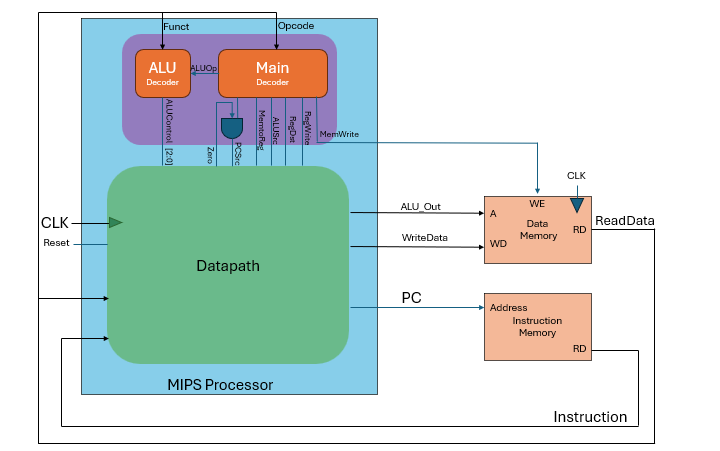

# Single-Cycle MIPS Processor

This project implements a modular single-cycle MIPS processor in Verilog. It includes core components such as the ALU, control unit, datapath, instruction memory, and data memory, along with comprehensive testbenches for simulation and verification.

## Features

- Modular design with clean separation of datapath and control logic
- Support for R-type, I-type, and basic branching instructions
- Preloaded instruction and data memory for simulation
- Waveform analysis and output trace verification
- Fully documented modules and simulation strategy

## Architecture Diagram

The following diagram illustrates the high-level structure of the Single-Cycle MIPS Processor, showing how the control unit, datapath, ALU, and memory modules interact:

This diagram provides a visual reference for instruction flow, control signal routing, and datapath connectivity. It is particularly useful during debugging and when extending the design to support pipelined execution.

## Module Overview

| Module             | Description                                                                 |
|--------------------|-----------------------------------------------------------------------------|
| `ALU.v`            | Performs arithmetic and logical operations based on control signals         |
| `Controller.v`     | Generates control signals based on instruction opcode and function field    |
| `Datapath.v`       | Connects registers, ALU, memory, and control signals to execute instructions|
| `InstructionMemory.v` | Stores and supplies instructions to the processor                           |
| `DataMemory.v`        | Handles read/write operations for data memory                               |
| `Mips_tb.v`      | Simulates processor behavior and verifies output correctness                |

## Simulation Strategy

- Use waveform viewers (e.g., GTKWave) to inspect signal transitions
- Verify register updates and memory access patterns
- Check control signal propagation and ALU outputs
- Compare expected vs. actual output traces for each instruction

## Getting Started

1. Clone the repository and navigate to the project directory.
2. Compile the Verilog files using your preferred simulator (e.g., ModelSim, Icarus Verilog).
3. Run the testbench and inspect the waveform output.
4. Modify instruction and data memory contents to test additional scenarios.

## Documentation

All modules are documented with inline comments and markdown descriptions. Refer to the `/docs` folder for detailed architecture notes and design decisions.

